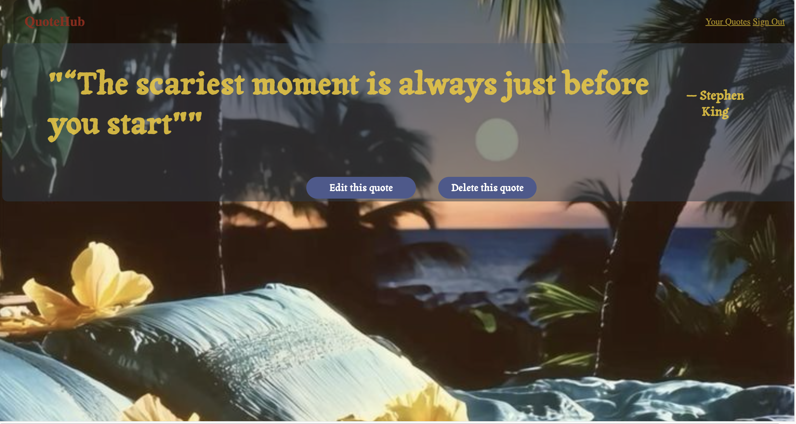

# quote-project-unit2# 📖 Quote Hub  





---


A web app for sharing, saving, and exploring quotes. Users can create their own quotes, view their quotes, and manage their personal collection. Built with **Node.js, Express, MongoDB, and EJS**.  

---

## 🚀 Features  
- ✍️ Create, edit, and delete your own quotes   
- 👤 User authentication (sign up / log in)   
- 🎨 Clean and responsive UI with EJS templates  

---

## 🛠️ Tech Stack  
- **Backend:** Node.js, Express  
- **Database:** MongoDB with Mongoose  
- **Frontend:** EJS templating, CSS  
- **Other:** dotenv for environment variables  

---

## 🎯 Future Goals

- Add user profile pages
- Create a home page to see other viewers created quotes
- Implement search functionality for quotes
- Allow users to like or favorite quotes
- Add a category or tag system for quotes
- Improve UI/UX design with better styling and animations


---

## 📂 Project Structure  

```
quote-project-unit2
├─ README.md
├─ controllers
│  ├─ auth.js
│  └─ quotes.js
├─ middleware
│  ├─ is-signed-in.js
│  └─ pass-user-to-view.js
├─ models
│  └─ user.js
├─ package-lock.json
├─ package.json
├─ public
│  └─ stylesheets
│     ├─ partials.css
│     ├─ pictures
│     │  ├─ 1.png
│     │  ├─ 2.png
│     │  ├─ 3.png
│     │  ├─ 4.png
│     │  ├─ 5.png
│     │  ├─ bb.jpg
│     │  ├─ bg-redfl.jpg
│     │  └─ bvg-flb.jpg
│     ├─ show.css
│     └─ style.css
├─ server.js
└─ views
   ├─ auth
   │  ├─ sign-in.ejs
   │  └─ sign-up.ejs
   ├─ index.ejs
   ├─ partials
   │  └─ _navbar.ejs
   └─ quotes
      ├─ edit.ejs
      ├─ index.ejs
      ├─ new.ejs
      └─ show.ejs

```
---


## Installation 
 1. **Clone the repository:**
    ```bash
    git clone https://github.com/your-username/quote-project-unit2.git
    cd quote-project-unit2
    ```
2. **Install dependencies:**
   ```bash
   npm install
    ```
 3. **Set up environment variables:**
    - Copy `.env.example` to `.env` and fill in the required values.
4. **Start the development server:**
    ```bash
    npm start    
    ```
5. **Open your browser and visit:**
   ```
    http://localhost:3000 
   ```
